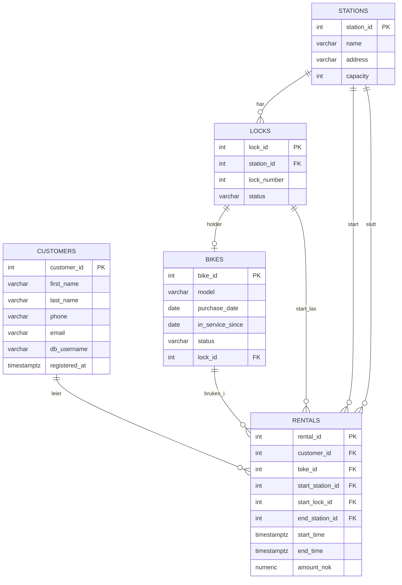

# Besvarelse - Refleksjon og Analyse

### PS!
Jeg har brukt KI for å formatere svarene mine slik at de er leselig på lik måte som oppgavene er formulert.
All av svar og kunnskap er ikke KI, men min egen svar

**Student:** [Abdirahman]

**Studentnummer:** [abali2659]

**Dato:** 1. mars 2026

---

## Del 1: Datamodellering

### Oppgave 1.1: Entiteter og attributter

**Identifiserte entiteter:**

Kunde, Sykkel, Sykkelstasjon, Lås, Utleie.

**Attributter for hver entitet:**

Kunde: `customer_id`, `first_name`, `last_name`, `phone`, `email`, `db_username`, `registered_at`.

Sykkel: `bike_id`, `model`, `purchase_date`, `in_service_since`, `status`, `lock_id`.

Sykkelstasjon: `station_id`, `name`, `address`, `capacity`.

Lås: `lock_id`, `station_id`, `lock_number`, `status`.

Utleie: `rental_id`, `customer_id`, `bike_id`, `start_station_id`, `start_lock_id`, `end_station_id`, `start_time`, `end_time`, `amount_nok`.

Begrunnelse: Dette er kjernen i caset. Det er disse vi må kunne lagre og knytte sammen. `Utleie` samler tid og betaling. `Lås` gjør kapasitet per stasjon og plassering av sykkel mulig.

---

### Oppgave 1.2: Datatyper og `CHECK`-constraints

**Valgte datatyper og begrunnelser:**

`SERIAL` for PK fordi det er stabilt og lett å jobbe med. Tekstfelt er `VARCHAR`. Dato bruker `DATE`, tid bruker `TIMESTAMPTZ`. Beløp er `NUMERIC(10,2)`.

**`CHECK`-constraints:**

- Telefon: kun siffer og ev. `+`.
- Epost: enkel epost‑regex.
- Kapasitet og låsnummer > 0.
- Statusfelt har faste verdier.
- `in_service_since >= purchase_date`.
- Utleie: sluttid >= start, og sluttstasjon/ beløp kun når sluttid er satt.

**ER-diagram:**



---

### Oppgave 1.3: Primærnøkler

**Valgte primærnøkler og begrunnelser:**

Jeg bruker surrogate‑nøkler (`SERIAL`) i alle tabeller. Det er stabilt og gir korte FK‑er.

**Naturlige vs. surrogatnøkler:**

Naturlige nøkler finnes (mobil, epost, stasjonsnavn), men de kan endres. Jeg lar dem være `UNIQUE` og bruker ID som PK.

**Oppdatert ER-diagram:**

Se ER‑diagrammet i 1.2.

---

### Oppgave 1.4: Forhold og fremmednøkler

**Identifiserte forhold og kardinalitet:**

- Stasjon → Lås: 1:M
- Lås → Sykkel: 1:0/1
- Kunde → Utleie: 1:M
- Sykkel → Utleie: 1:M
- Utleie starter ved 1 stasjon og ender ved 1 stasjon (M:1 for begge)

**Fremmednøkler:**

`locks.station_id -> stations.station_id`

`bikes.lock_id -> locks.lock_id`

`rentals.customer_id -> customers.customer_id`

`rentals.bike_id -> bikes.bike_id`

`rentals.start_station_id -> stations.station_id`

`rentals.end_station_id -> stations.station_id`

`rentals.start_lock_id -> locks.lock_id`

**Oppdatert ER-diagram:**

Se ER‑diagrammet i 1.2.

---

### Oppgave 1.5: Normalisering

**Vurdering av 1. normalform (1NF):**

Alt er atomisk og hver rad har PK. 1NF er ok.

**Vurdering av 2. normalform (2NF):**

Ingen sammensatte PK‑er, så ingen delvise avhengigheter. 2NF er ok.

**Vurdering av 3. normalform (3NF):**

Ingen transitive avhengigheter. Stasjonsinfo ligger i `stations`, ikke i `rentals`. 3NF er ok.

**Eventuelle justeringer:**

Ingen.

---

## Del 2: Database-implementering

### Oppgave 2.1: SQL-skript for database-initialisering

**Plassering av SQL-skript:**

SQL‑skriptet ligger i `init-scripts/01-init-database.sql`.

**Antall testdata:**

- Kunder: 5
- Sykler: 100
- Sykkelstasjoner: 5
- Låser: 100
- Utleier: 50

---

### Oppgave 2.2: Kjøre initialiseringsskriptet

**Dokumentasjon av vellykket kjøring:**

Kjørte `docker compose -f docker-compose.yml up -d` i `/home/abala038/IdeaProjects/data1500-oblig-01-besvart`. Init‑scriptet kjørte uten feil.

Spørring mot systemkatalogen:

```sql
SELECT table_name
FROM information_schema.tables
WHERE table_schema = 'public'
  AND table_type = 'BASE TABLE'
ORDER BY table_name;
```

**Resultat:**

```
 table_name
------------
 bikes
 customers
 locks
 rentals
 stations
(5 rows)
```

---

## Del 3: Tilgangskontroll

### Oppgave 3.1: Roller og brukere

**SQL for å opprette rolle:**

```sql
CREATE ROLE kunde;
```

**SQL for å opprette bruker:**

```sql
CREATE USER kunde_1 WITH PASSWORD 'kunde123';
GRANT kunde TO kunde_1;
```

**SQL for å tildele rettigheter:**

```sql
REVOKE ALL ON customers, rentals FROM PUBLIC;
GRANT SELECT ON stations, locks, bikes TO kunde;
GRANT SELECT ON v_kunde_utleier TO kunde;
```

---

### Oppgave 3.2: Begrenset visning for kunder

**SQL for VIEW:**

```sql
CREATE VIEW v_kunde_utleier AS
SELECT r.rental_id, r.bike_id, r.start_station_id, r.end_station_id,
       r.start_time, r.end_time, r.amount_nok
FROM rentals r
JOIN customers c ON c.customer_id = r.customer_id
WHERE c.db_username = current_user;
```

**Ulempe med VIEW vs. POLICIES:**

VIEW må kombineres med strenge GRANTs og beskytter ikke mot direkte spørring på basetabeller om noen får tilgang. RLS‑policies håndheves direkte på tabellen for alle spørringer.

---

## Del 4: Analyse og Refleksjon

### Oppgave 4.1: Lagringskapasitet

**Totalt antall utleier per år:**

Høysesong: 5 * 20000 = 100000

Mellomsesong: 4 * 5000 = 20000

Lavsesong: 3 * 500 = 1500

Totalt: 121500 utleier.

**Estimat for lagringskapasitet:**

`rentals`‑rad ~ 120 byte (FK‑er, tidsstempel, beløp, overhead).

121500 * 120 byte ≈ 14,6 MB.

Indekser + øvrige tabeller ~ 10 MB.

**Totalt for første år:**

~25 MB totalt.

---

### Oppgave 4.2: Flat fil vs. relasjonsdatabase

**Analyse av CSV-filen (`data/utleier.csv`):**

**Problem 1: Redundans**

Kunde- og stasjonsdata gjentas per rad (f.eks. Ole Hansen + epost/telefon; stasjonsnavn/adresse).

**Problem 2: Inkonsistens**

Endres en stasjonsadresse i én rad, men ikke i andre, får vi inkonsistente data.

**Problem 3: Oppdateringsanomalier**

Oppdatering: endring av epost krever oppdatering i mange rader.

Sletting: sletter siste utleie, mister kundedata.

Innsetting: kan ikke legge inn kunde uten utleie.

**Fordeler med en indeks:**

Indeks på `rentals(bike_id)` gir raskt oppslag uten full tabellskann.

**Case 1: Indeks passer i RAM**

B+-tre i minnet gir få IO og raskt oppslag (log n).

**Case 2: Indeks passer ikke i RAM**

Bygging/vedlikehold gjøres med ekstern flettesortering og disk‑baserte runs.

**Datastrukturer i DBMS:**

B+-tre for range/sortering, hash for eksakte oppslag.

---

### Oppgave 4.3: Datastrukturer for logging

**Foreslått datastruktur:**

LSM‑tree (append‑only).

**Begrunnelse:**

**Skrive-operasjoner:** Sekvensielle appends gir høy write‑throughput.

**Lese-operasjoner:** Oppslag via indeks/kompaksjon; lesing er sjeldnere og tåler høyere kost.

---

### Oppgave 4.4: Validering i flerlags-systemer

**Hvor bør validering gjøres:**

I alle lag.

**Validering i nettleseren:** Rask feedback, men kan omgås.

**Validering i applikasjonslaget:** Forretningsregler og konsistente feilmeldinger.

**Validering i databasen:** Siste forsvarslinje med FK/`CHECK`.

**Konklusjon:** Kombiner alle tre.

---

### Oppgave 4.5: Refleksjon over læringsutbytte

**Hva har du lært så langt i emnet:**

Å gå fra case til normalisert modell med PK/FK og constraints.

**Hvordan har denne oppgaven bidratt til å oppnå læringsmålene:**

Jeg har brukt teori i praksis: modellering, SQL‑implementering og spørringer.

**Hva var mest utfordrende:**

Å holde konsistens mellom ER‑diagram og SQL, og å modellere lås/stasjon riktig.

**Hva har du lært om databasedesign:**

God design handler om avgrensning, normalisering og konsekvente nøkler/constraints.

---

## Del 5: SQL-spørringer og Automatisk Testing

**Plassering av SQL-spørringer:**

Spørringene ligger i `test-scripts/queries.sql`.

**Eventuelle feil og rettelser:**

Kjørte `test-scripts/queries.sql` med `psql` og alle spørringer kjørte uten feil. Output:

```
 bike_id |     model      | purchase_date | in_service_since | status | lock_id 
---------+----------------+---------------+------------------+--------+---------
       1 | Urban Cruiser  | 2023-01-11    | 2023-01-18       | active |       1
       2 | EcoBike 3000   | 2023-01-12    | 2023-01-19       | active |       2
       3 | City Bike Lite | 2023-01-13    | 2023-01-20       | active |       3
       4 | City Bike Pro  | 2023-01-14    | 2023-01-21       | active |       4
       5 | Urban Cruiser  | 2023-01-15    | 2023-01-22       | active |       5
       6 | EcoBike 3000   | 2023-01-16    | 2023-01-23       | active |       6
       7 | City Bike Lite | 2023-01-17    | 2023-01-24       | active |       7
       8 | City Bike Pro  | 2023-01-18    | 2023-01-25       | active |       8
       9 | Urban Cruiser  | 2023-01-19    | 2023-01-26       | active |       9
      10 | EcoBike 3000   | 2023-01-20    | 2023-01-27       | active |      10
      11 | City Bike Lite | 2023-01-21    | 2023-01-28       | active |        
      12 | City Bike Pro  | 2023-01-22    | 2023-01-29       | active |      12
      13 | Urban Cruiser  | 2023-01-23    | 2023-01-30       | active |      13
      14 | EcoBike 3000   | 2023-01-24    | 2023-01-31       | active |      14
      15 | City Bike Lite | 2023-01-25    | 2023-02-01       | active |      15
      16 | City Bike Pro  | 2023-01-26    | 2023-02-02       | active |      16
      17 | Urban Cruiser  | 2023-01-27    | 2023-02-03       | active |      17
      18 | EcoBike 3000   | 2023-01-28    | 2023-02-04       | active |      18
      19 | City Bike Lite | 2023-01-29    | 2023-02-05       | active |      19
      20 | City Bike Pro  | 2023-01-30    | 2023-02-06       | active |      20
      21 | Urban Cruiser  | 2023-01-31    | 2023-02-07       | active |        
      22 | EcoBike 3000   | 2023-02-01    | 2023-02-08       | active |      22
      23 | City Bike Lite | 2023-02-02    | 2023-02-09       | active |      23
      24 | City Bike Pro  | 2023-02-03    | 2023-02-10       | active |      24
      25 | Urban Cruiser  | 2023-02-04    | 2023-02-11       | active |      25
      26 | EcoBike 3000   | 2023-02-05    | 2023-02-12       | active |      26
      27 | City Bike Lite | 2023-02-06    | 2023-02-13       | active |      27
      28 | City Bike Pro  | 2023-02-07    | 2023-02-14       | active |      28
      29 | Urban Cruiser  | 2023-02-08    | 2023-02-15       | active |      29
      30 | EcoBike 3000   | 2023-02-09    | 2023-02-16       | active |      30
      31 | City Bike Lite | 2023-02-10    | 2023-02-17       | active |        
      32 | City Bike Pro  | 2023-02-11    | 2023-02-18       | active |      32
      33 | Urban Cruiser  | 2023-02-12    | 2023-02-19       | active |      33
      34 | EcoBike 3000   | 2023-02-13    | 2023-02-20       | active |      34
      35 | City Bike Lite | 2023-02-14    | 2023-02-21       | active |      35
      36 | City Bike Pro  | 2023-02-15    | 2023-02-22       | active |      36
      37 | Urban Cruiser  | 2023-02-16    | 2023-02-23       | active |      37
      38 | EcoBike 3000   | 2023-02-17    | 2023-02-24       | active |      38
      39 | City Bike Lite | 2023-02-18    | 2023-02-25       | active |      39
      40 | City Bike Pro  | 2023-02-19    | 2023-02-26       | active |      40
      41 | Urban Cruiser  | 2023-02-20    | 2023-02-27       | active |        
      42 | EcoBike 3000   | 2023-02-21    | 2023-02-28       | active |      42
      43 | City Bike Lite | 2023-02-22    | 2023-03-01       | active |      43
      44 | City Bike Pro  | 2023-02-23    | 2023-03-02       | active |      44
      45 | Urban Cruiser  | 2023-02-24    | 2023-03-03       | active |      45
      46 | EcoBike 3000   | 2023-02-25    | 2023-03-04       | active |      46
      47 | City Bike Lite | 2023-02-26    | 2023-03-05       | active |      47
      48 | City Bike Pro  | 2023-02-27    | 2023-03-06       | active |      48
      49 | Urban Cruiser  | 2023-02-28    | 2023-03-07       | active |      49
      50 | EcoBike 3000   | 2023-03-01    | 2023-03-08       | active |      50
      51 | City Bike Lite | 2023-03-02    | 2023-03-09       | active |        
      52 | City Bike Pro  | 2023-03-03    | 2023-03-10       | active |      52
      53 | Urban Cruiser  | 2023-03-04    | 2023-03-11       | active |      53
      54 | EcoBike 3000   | 2023-03-05    | 2023-03-12       | active |      54
      55 | City Bike Lite | 2023-03-06    | 2023-03-13       | active |      55
      56 | City Bike Pro  | 2023-03-07    | 2023-03-14       | active |      56
      57 | Urban Cruiser  | 2023-03-08    | 2023-03-15       | active |      57
      58 | EcoBike 3000   | 2023-03-09    | 2023-03-16       | active |      58
      59 | City Bike Lite | 2023-03-10    | 2023-03-17       | active |      59
      60 | City Bike Pro  | 2023-03-11    | 2023-03-18       | active |      60
      61 | Urban Cruiser  | 2023-03-12    | 2023-03-19       | active |      61
      62 | EcoBike 3000   | 2023-03-13    | 2023-03-20       | active |      62
      63 | City Bike Lite | 2023-03-14    | 2023-03-21       | active |      63
      64 | City Bike Pro  | 2023-03-15    | 2023-03-22       | active |      64
      65 | Urban Cruiser  | 2023-03-16    | 2023-03-23       | active |      65
      66 | EcoBike 3000   | 2023-03-17    | 2023-03-24       | active |      66
      67 | City Bike Lite | 2023-03-18    | 2023-03-25       | active |      67
      68 | City Bike Pro  | 2023-03-19    | 2023-03-26       | active |      68
      69 | Urban Cruiser  | 2023-03-20    | 2023-03-27       | active |      69
      70 | EcoBike 3000   | 2023-03-21    | 2023-03-28       | active |      70
      71 | City Bike Lite | 2023-03-22    | 2023-03-29       | active |      71
      72 | City Bike Pro  | 2023-03-23    | 2023-03-30       | active |      72
      73 | Urban Cruiser  | 2023-03-24    | 2023-03-31       | active |      73
      74 | EcoBike 3000   | 2023-03-25    | 2023-04-01       | active |      74
      75 | City Bike Lite | 2023-03-26    | 2023-04-02       | active |      75
      76 | City Bike Pro  | 2023-03-27    | 2023-04-03       | active |      76
      77 | Urban Cruiser  | 2023-03-28    | 2023-04-04       | active |      77
      78 | EcoBike 3000   | 2023-03-29    | 2023-04-05       | active |      78
      79 | City Bike Lite | 2023-03-30    | 2023-04-06       | active |      79
      80 | City Bike Pro  | 2023-03-31    | 2023-04-07       | active |      80
      81 | Urban Cruiser  | 2023-04-01    | 2023-04-08       | active |      81
      82 | EcoBike 3000   | 2023-04-02    | 2023-04-09       | active |      82
      83 | City Bike Lite | 2023-04-03    | 2023-04-10       | active |      83
      84 | City Bike Pro  | 2023-04-04    | 2023-04-11       | active |      84
      85 | Urban Cruiser  | 2023-04-05    | 2023-04-12       | active |      85
      86 | EcoBike 3000   | 2023-04-06    | 2023-04-13       | active |      86
      87 | City Bike Lite | 2023-04-07    | 2023-04-14       | active |      87
      88 | City Bike Pro  | 2023-04-08    | 2023-04-15       | active |      88
      89 | Urban Cruiser  | 2023-04-09    | 2023-04-16       | active |      89
      90 | EcoBike 3000   | 2023-04-10    | 2023-04-17       | active |      90
      91 | City Bike Lite | 2023-04-11    | 2023-04-18       | active |      91
      92 | City Bike Pro  | 2023-04-12    | 2023-04-19       | active |      92
      93 | Urban Cruiser  | 2023-04-13    | 2023-04-20       | active |      93
      94 | EcoBike 3000   | 2023-04-14    | 2023-04-21       | active |      94
      95 | City Bike Lite | 2023-04-15    | 2023-04-22       | active |      95
      96 | City Bike Pro  | 2023-04-16    | 2023-04-23       | active |      96
      97 | Urban Cruiser  | 2023-04-17    | 2023-04-24       | active |      97
      98 | EcoBike 3000   | 2023-04-18    | 2023-04-25       | active |      98
      99 | City Bike Lite | 2023-04-19    | 2023-04-26       | active |      99
     100 | City Bike Pro  | 2023-04-20    | 2023-04-27       | active |     100
(100 rows)

 last_name | first_name |    phone    
-----------+------------+-------------
 Andersen  | Per        | +4793456789
 Hansen    | Ole        | +4791234567
 Johansen  | Lise       | +4794567890
 Nilsen    | Anna       | +4796789012
 Olsen     | Kari       | +4792345678
(5 rows)

 bike_id |     model      | in_service_since 
---------+----------------+------------------
      75 | City Bike Lite | 2023-04-02
      76 | City Bike Pro  | 2023-04-03
      77 | Urban Cruiser  | 2023-04-04
      78 | EcoBike 3000   | 2023-04-05
      79 | City Bike Lite | 2023-04-06
      80 | City Bike Pro  | 2023-04-07
      81 | Urban Cruiser  | 2023-04-08
      82 | EcoBike 3000   | 2023-04-09
      83 | City Bike Lite | 2023-04-10
      84 | City Bike Pro  | 2023-04-11
      85 | Urban Cruiser  | 2023-04-12
      86 | EcoBike 3000   | 2023-04-13
      87 | City Bike Lite | 2023-04-14
      88 | City Bike Pro  | 2023-04-15
      89 | Urban Cruiser  | 2023-04-16
      90 | EcoBike 3000   | 2023-04-17
      91 | City Bike Lite | 2023-04-18
      92 | City Bike Pro  | 2023-04-19
      93 | Urban Cruiser  | 2023-04-20
      94 | EcoBike 3000   | 2023-04-21
      95 | City Bike Lite | 2023-04-22
      96 | City Bike Pro  | 2023-04-23
      97 | Urban Cruiser  | 2023-04-24
      98 | EcoBike 3000   | 2023-04-25
      99 | City Bike Lite | 2023-04-26
     100 | City Bike Pro  | 2023-04-27
(26 rows)

 antall_kunder 
---------------
             5
(1 row)

 customer_id | first_name | last_name | antall_utleier 
-------------+------------+-----------+----------------
           1 | Ole        | Hansen    |             10
           2 | Kari       | Olsen     |             10
           3 | Per        | Andersen  |             10
           4 | Lise       | Johansen  |             10
           5 | Anna       | Nilsen    |             10
(5 rows)

 customer_id | first_name | last_name 
-------------+------------+-----------
(0 rows)

 bike_id |     model      
---------+----------------
       1 | Urban Cruiser
      52 | City Bike Pro
      53 | Urban Cruiser
      54 | EcoBike 3000
      55 | City Bike Lite
      56 | City Bike Pro
      57 | Urban Cruiser
      58 | EcoBike 3000
      59 | City Bike Lite
      60 | City Bike Pro
      61 | Urban Cruiser
      62 | EcoBike 3000
      63 | City Bike Lite
      64 | City Bike Pro
      65 | Urban Cruiser
      66 | EcoBike 3000
      67 | City Bike Lite
      68 | City Bike Pro
      69 | Urban Cruiser
      70 | EcoBike 3000
      71 | City Bike Lite
      72 | City Bike Pro
      73 | Urban Cruiser
      74 | EcoBike 3000
      75 | City Bike Lite
      76 | City Bike Pro
      77 | Urban Cruiser
      78 | EcoBike 3000
      79 | City Bike Lite
      80 | City Bike Pro
      81 | Urban Cruiser
      82 | EcoBike 3000
      83 | City Bike Lite
      84 | City Bike Pro
      85 | Urban Cruiser
      86 | EcoBike 3000
      87 | City Bike Lite
      88 | City Bike Pro
      89 | Urban Cruiser
      90 | EcoBike 3000
      91 | City Bike Lite
      92 | City Bike Pro
      93 | Urban Cruiser
      94 | EcoBike 3000
      95 | City Bike Lite
      96 | City Bike Pro
      97 | Urban Cruiser
      98 | EcoBike 3000
      99 | City Bike Lite
     100 | City Bike Pro
(50 rows)

 bike_id |     model      | customer_id | first_name | last_name |       start_time       
---------+----------------+-------------+------------+-----------+------------------------
      11 | City Bike Lite |           1 | Ole        | Hansen    | 2024-06-11 06:00:00+00
      21 | Urban Cruiser  |           1 | Ole        | Hansen    | 2024-06-21 06:00:00+00
      31 | City Bike Lite |           1 | Ole        | Hansen    | 2024-07-01 06:00:00+00
      41 | Urban Cruiser  |           1 | Ole        | Hansen    | 2024-07-11 06:00:00+00
      51 | City Bike Lite |           1 | Ole        | Hansen    | 2024-07-21 06:00:00+00
(5 rows)
```

---

## Del 6: Bonusoppgaver (Valgfri)

### Oppgave 6.1: Trigger for lagerbeholdning

Ikke løst. ikke tid

---

### Oppgave 6.2: Presentasjon

Ikke levert. ikke tid

---

**Slutt på besvarelse**
